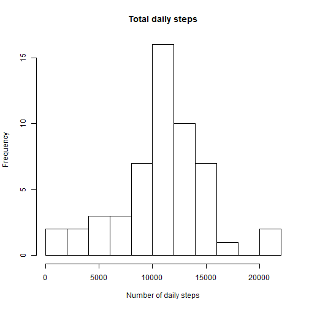
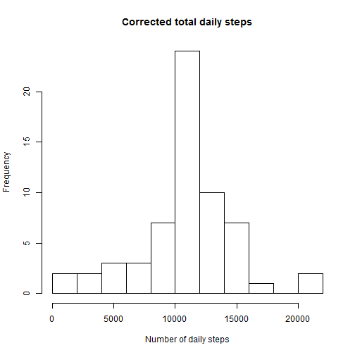
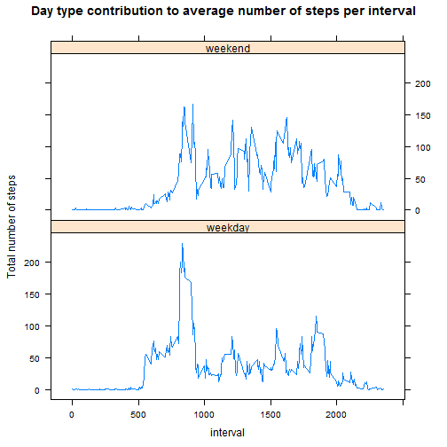

## Loading and preprocessing the data

### Reading the compressed activity data


```r
infile <- "activity.csv"
if (!file.exists(infile)) {
    unzip("activity.zip")
}
```

### Processing/transforming the data


```r
# Read activity data making sure the date column is recognized as a Date
data <- read.csv(infile, colClasses=c(NA, 'Date', NA))
```


## What is mean total number of steps taken per day?

### Histogram of the total number of steps taken each day

First, let's compute the total number of steps per day.


```r
library(plyr)

# Compute total number of steps on a daily basis (aggregate per date)
steps_per_day <- ddply(data, .(date), summarize, total=sum(steps))
```

Next, display a histogram showing the frequency of total daily steps. 


```r
hist(steps_per_day$total,
     breaks = 10,
     main = "Total daily steps",
     xlab = "Number of daily steps")
```

 

### Mean and median total number of steps taken per day

The mean and median of the total number of daily steps are:


```r
mean_steps_per_day <- mean(steps_per_day$total, na.rm = TRUE)
median_steps_per_day <- median(steps_per_day$total, na.rm = TRUE)
```

- Mean: 10766
- Median: 10765


## What is the average daily activity pattern?

### Daily activity time series plot 

First, let's compute the average daily activity by aggregating each interval taking the mean number of steps (i.e. average the number of steps taken across all days).


```r
avg_daily_activity <- ddply(data, .(interval), summarize, total=mean(steps,na.rm=TRUE))
```

Next, display the average daily activity by time interval.


```r
plot(avg_daily_activity$interval, avg_daily_activity$total,
     type = 'l',
     main = "Average daily activity by interval",
     xlab = 'Interval',
     ylab = 'Number of steps')
```

 

### 5-minute interval containing the maximum number of steps

The 5-min interval which contains the maximum number of steps is:


```r
interval_max <- avg_daily_activity$interval[which.max(avg_daily_activity$total)]
```

The interval **835** contains the maximum number of steps. 


## Imputing missing values

### Total number of missing values

The number of missing values is:


```r
sum(!complete.cases(data$steps))
```

```
## [1] 2304
```

The missing value breakdown is as follows:

Variable | Missing Value Count
---:     | :---
Steps    | 2304
Date     | 0 
Interval | 0

> We will only consider missing step values as they are the sole missing value contributor as demonstrated by the previous table.

### Strategy for filling in all of the missing values

The strategy for filling the missing step values is to use the rounded mean for the corresponding 5-min interval. We round the values because steps need to be whole integer numbers.

### Corrected data set

The corrected data set is computed as follows:


```r
corrected <- data
mean_intervals <- join(corrected, avg_daily_activity, by = 'interval')
corrected$steps <- with(mean_intervals, ifelse(is.na(steps), round(total), steps))
```

> Note that we round the average steps (i.e. `round(total)`) because steps need to be whole integer numbers.

Let's update the total daily steps based on the new corrected values.


```r
corr_steps_per_day <- ddply(corrected, .(date), summarize, total=sum(steps))
```

### Comparing to the uncorrected data set

Let's display a histogram showing the frequency of the corrected total daily steps. 


```r
hist(corr_steps_per_day$total,
     breaks = 10,
     main = "Corrected total daily steps",
     xlab = "Number of daily steps")
```

 

The corrected mean and median of the total number of daily steps become:


```r
corr_mean_steps_per_day <- mean(corr_steps_per_day$total, na.rm = TRUE)
corr_median_steps_per_day <- median(corr_steps_per_day$total, na.rm = TRUE)
```

- Mean: 10765
- Median: 10762

**Both are pratically equal** to the uncorrected ones. This is because we used the rounded mean of the daily steps per interval to cope for the missing step values. This has the effect of replicating the existing behavior observed hence not impacting the mean and median much.


## Are there differences in activity patterns between weekdays and weekends?

### Weekend factor

Let's extend the corrected data set with a new factor variable, `daytype`, which indicates the type of day (`weekday` or `weekend`):


```r
corrected$daytype <- as.factor(ifelse(weekdays(data$date) %in% c('Saturday', 'Sunday'), 'weekend', 'weekday'))
```

### Weekend impact on activity plots

Let's plot the day type contribution to the average number of steps per interval. This is achieved by averaging the number of steps over each interval and grouping per day type. Again, we round the mean step values because they need to be whole integer numbers.


```r
library(lattice)

# Compute the average number of steps per interval over each day type
steps_per_daytype <- ddply(corrected, .(daytype, interval), summarize, total=round(mean(steps)))

xyplot(total ~ interval | daytype,
       type = "l",
       data = steps_per_daytype,
       main = 'Day type contribution to average number of steps per interval',
       ylab = 'Total number of steps',
       layout = c(1, 2))
```

 
